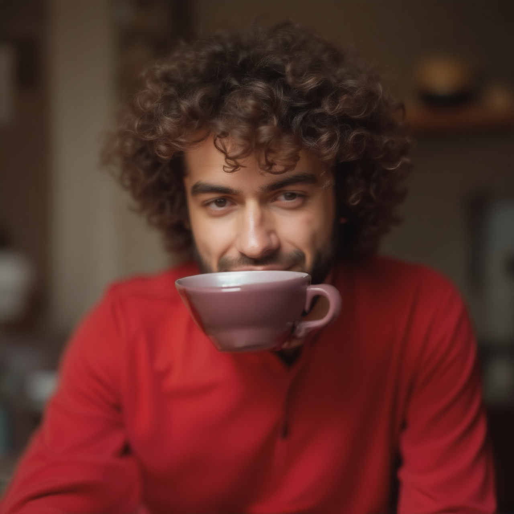
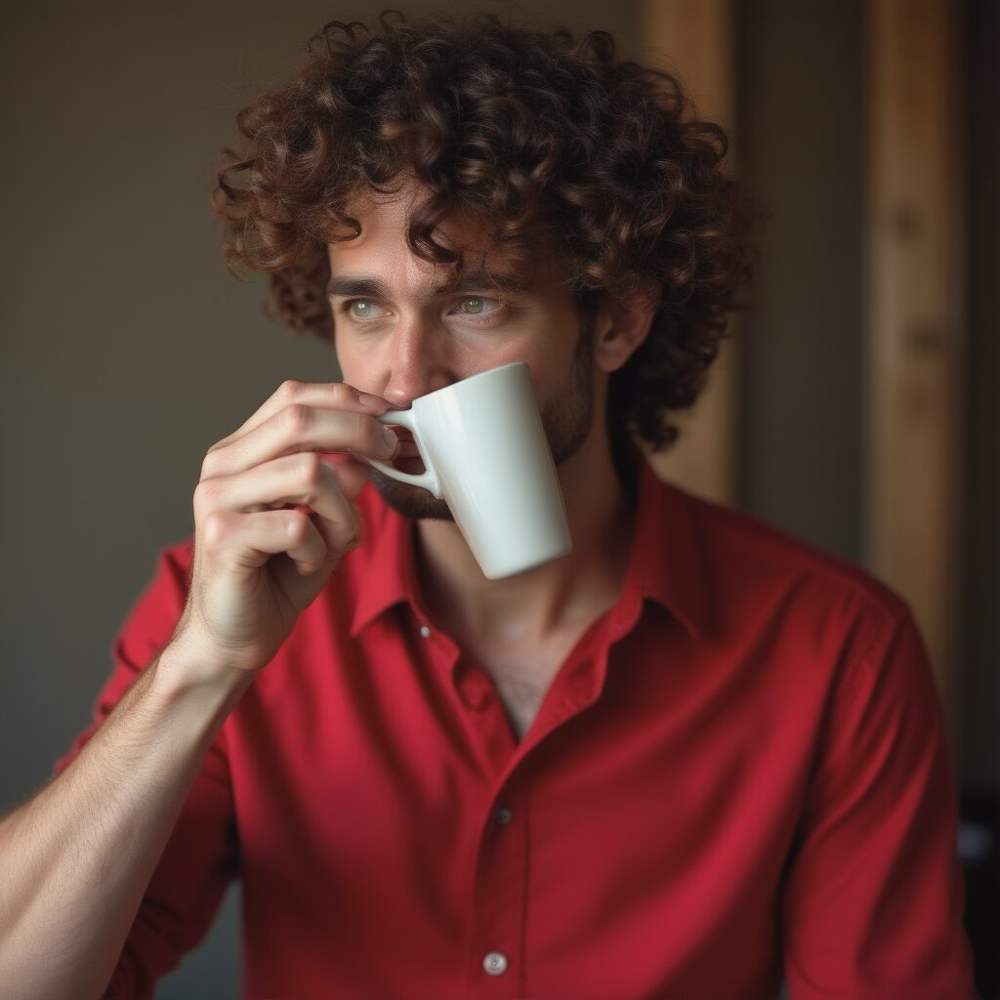
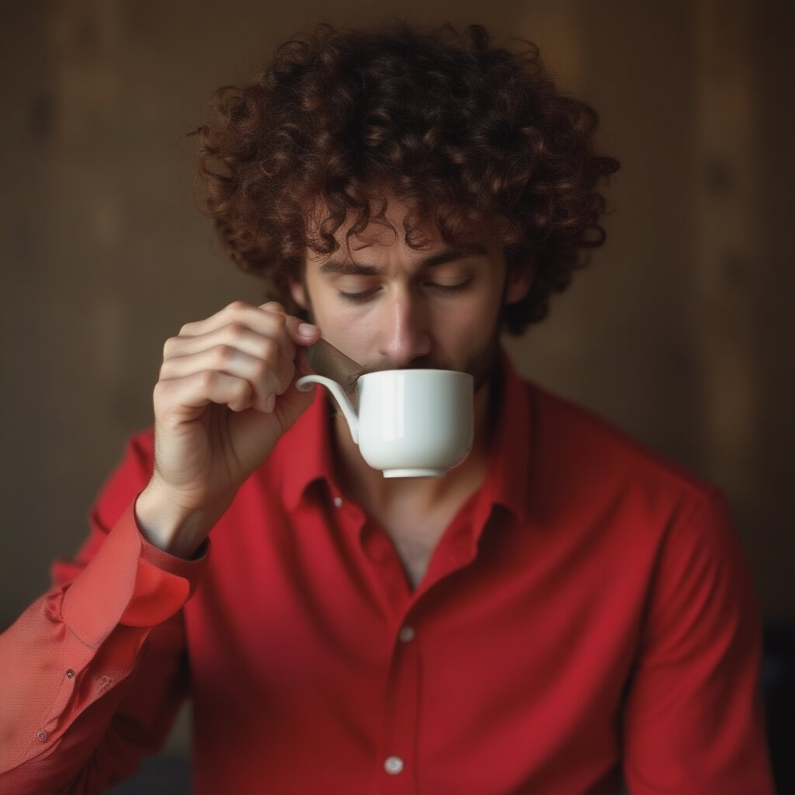
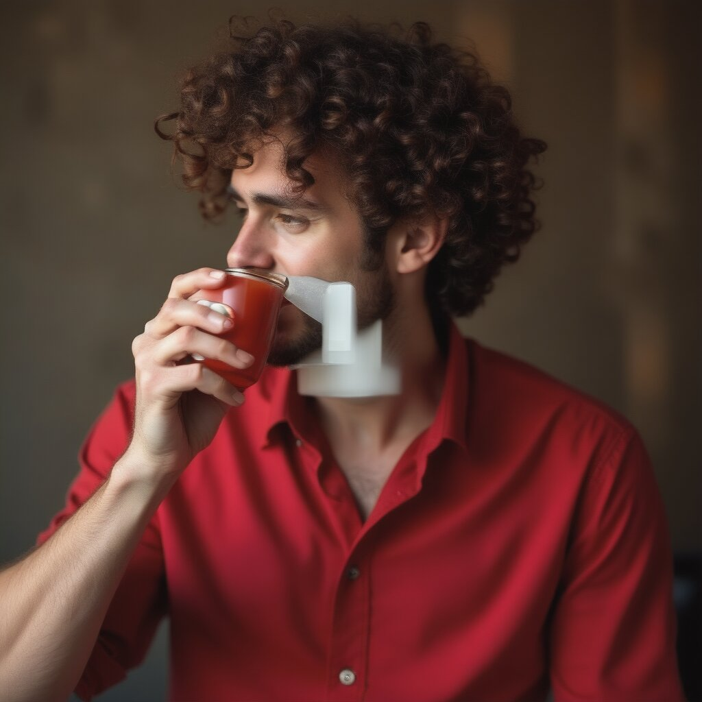
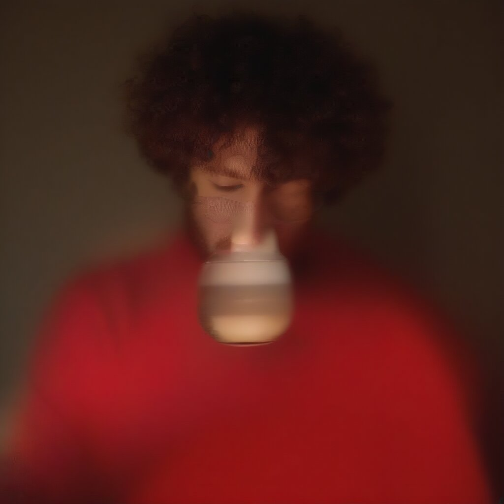
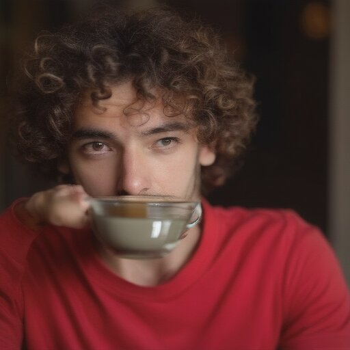
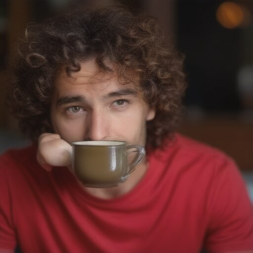

# Simple prompt

You can drag and drop the main image, use the workflows for the others

prompt:

```
A curly-haired man in a red shirt is drinking tea.
```

- Steps: 25
- Resolution: 1024x1024
- Guidance: 2.5/1.6
- Seed: 0
- Workflow: [Best_workflow.json](Best_workflow.json)



Other values:

# @1024x1024

## 1

- Steps: 50
- Resolution: 1024x1024
- Guidance: 2.5/1.6
- Seed: 0



[workflow](1/OmniGen_00044__workflow.json)

## 2

- Steps: 15
- Resolution: 1024x1024
- Guidance: 2.5/1.6
- Seed: 0



[workflow](1/OmniGen_00042__workflow.json)

## 3

Here looks like the model when for a white cup, and then changed its mind ;-)

- Steps: 25
- Resolution: 1024x1024
- Guidance: 2.5/1.6
- Seed: 0



[workflow](1/OmniGen_00043__workflow.json)

## 4

To genmerate an image from a prompt 5 steps isn't enough

- Steps: 5
- Resolution: 1024x1024
- Guidance: 2.5/1.6
- Seed: 0



[workflow](1/OmniGen_00041__workflow.json)


# @512x512

It tries to add the arm, but fails

## 1

- Steps: 50
- Resolution: 512x512
- Guidance: 2.5/1.6
- Seed: 0



[workflow](1/OmniGen_00046__workflow.json)

## 2

- Steps: 25
- Resolution: 512x512
- Guidance: 2.5/1.6
- Seed: 0



[workflow](1/OmniGen_00045__workflow.json)

