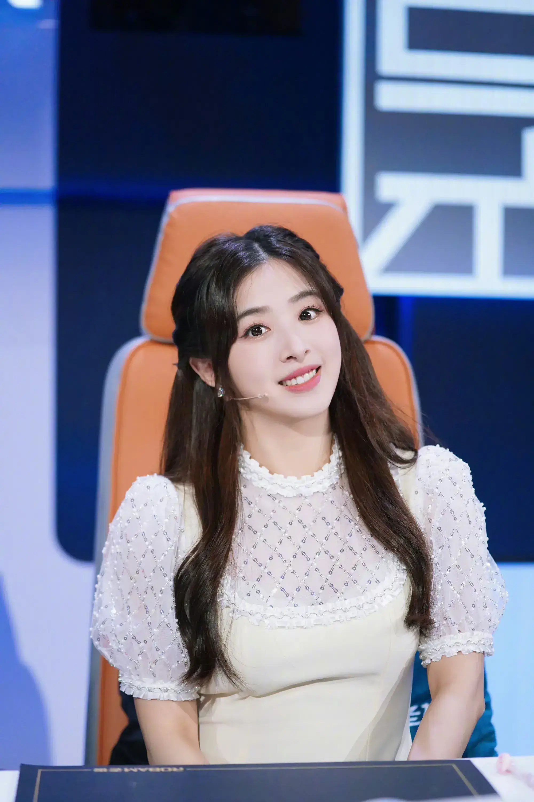
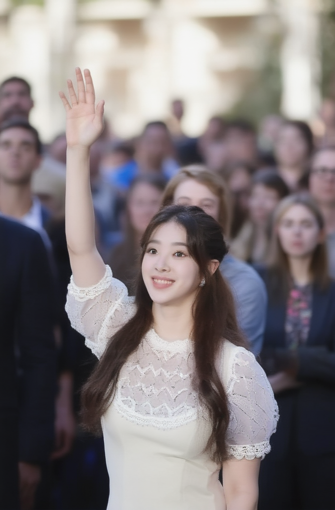
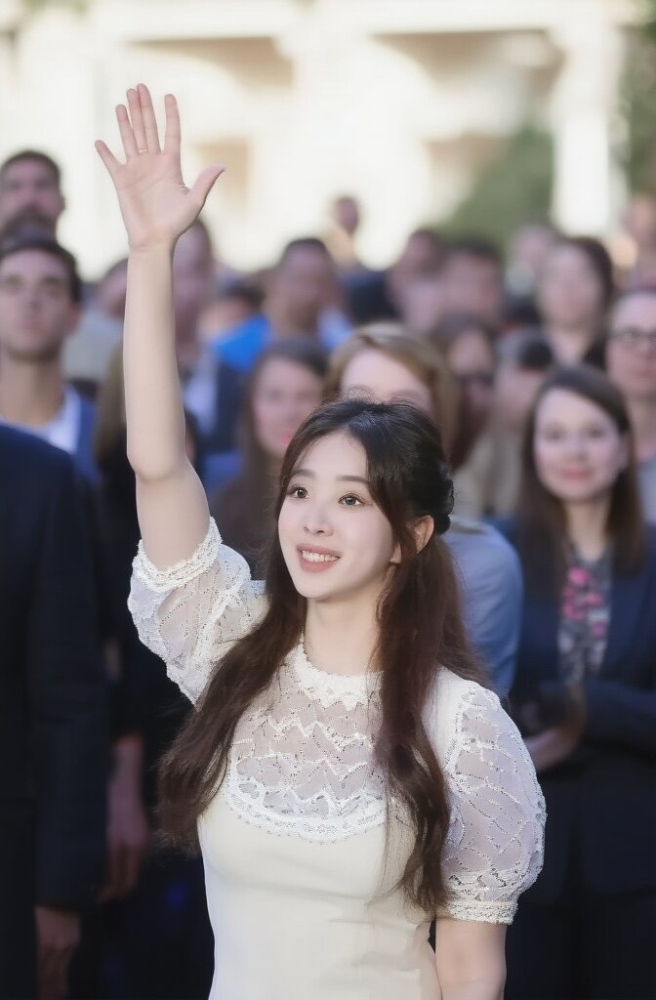
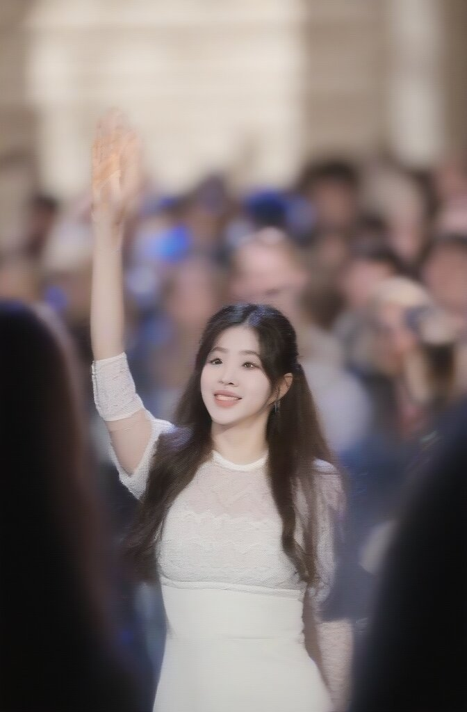

# Aspect of a character

You can drag and drop the main image, use the workflows for the others

prompt:

```
The woman in image_1 waves her hand happily in the crowd
```

image_1:



- Steps: 25
- Resolution: 672x1024
- Guidance: 2.5/1.9
- Seed: 128
- Workflow: [Best_workflow.json](Best_workflow.json)



Other values:

# @672x1024

## 1

50 steps aren't better

- Steps: 50
- Resolution: 672x1024
- Guidance: 2.5/1.9
- Seed: 128



[workflow](1/OmniGen_00050__workflow.json)

## 2

5 steps aren't enough here

- Steps: 5
- Resolution: 672x1024
- Guidance: 2.5/1.9
- Seed: 128



[workflow](1/OmniGen_00049__workflow.json)


