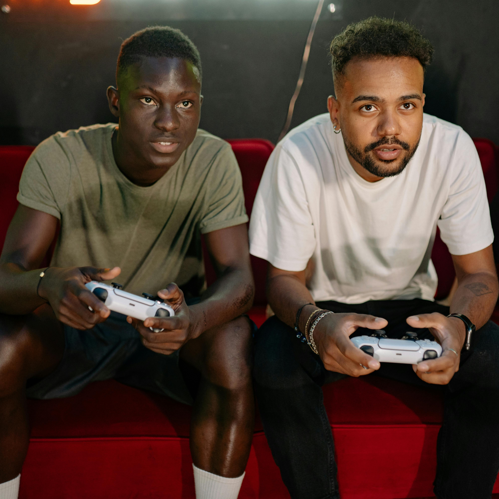
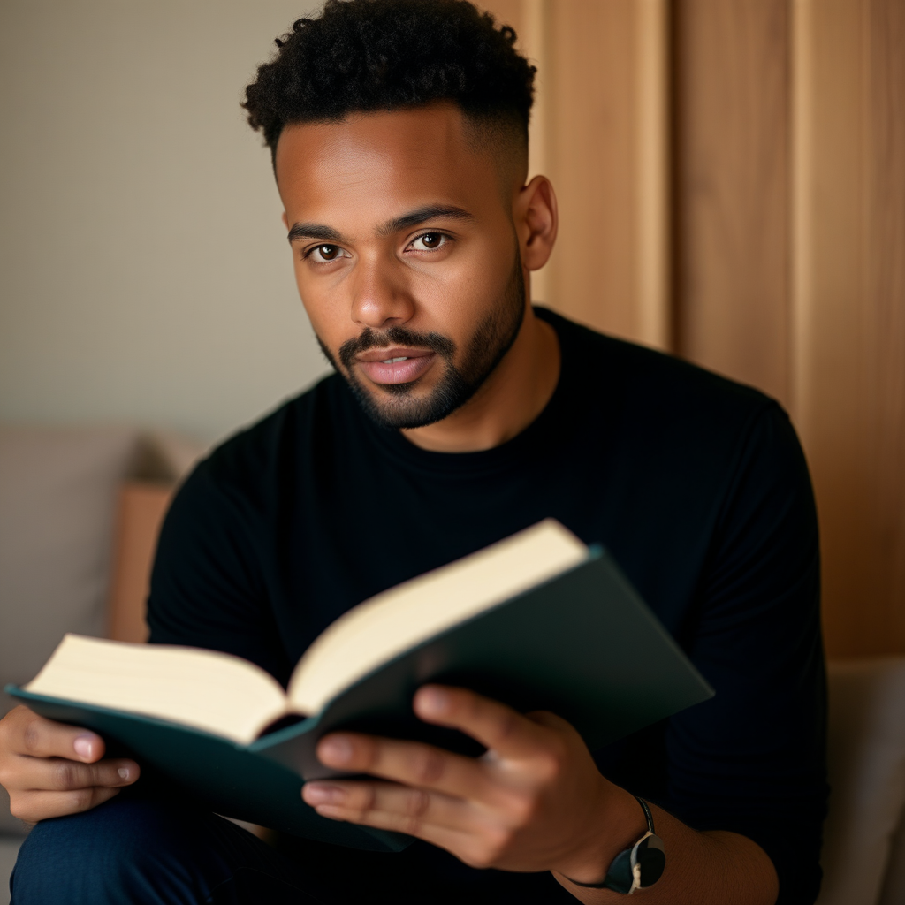
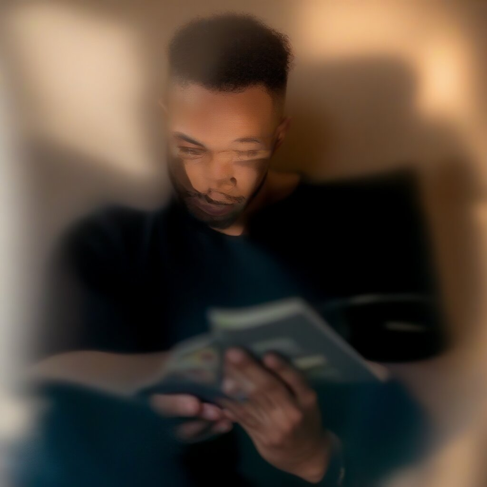

# Aspect of a character plus identify which one

You can drag and drop the main image, use the workflows for the others

prompt:

```
A man in a black shirt is reading a book. The man is the right man in image_1.
```

image_1:



- Steps: 25
- Resolution: 1024x1024
- Guidance: 2.5/1.6
- Seed: 0
- Workflow: [Best_workflow.json](Best_workflow.json)



Note that 25 steps is enough here

Other values:

# @1024x1024

## 1

5 steps aren't enough

- Steps: 5
- Resolution: 1024x1024
- Guidance: 2.5/1.6
- Seed: 0



[workflow](1/OmniGen_00051__workflow.json)

