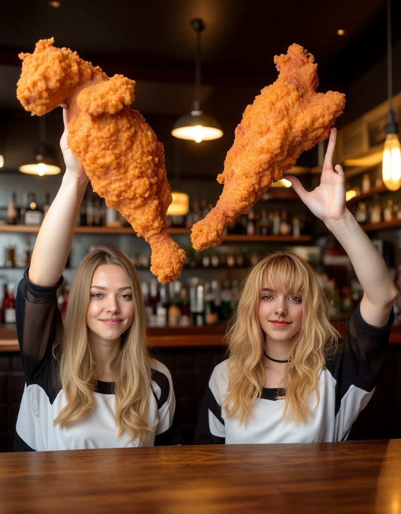

# Faces from 2 images

You can drag and drop the main image, use the workflows for the others

prompt:

```
Two woman are raising fried chicken legs in a bar. A woman is image_1. Another woman is image_2.
```

image_1:


image_2:


- Steps: 25
- Resolution: 800x1024
- Guidance: 2.5/1.6
- Seed: 0
- Workflow: [OmniGen_00053__workflow.json](OmniGen_00053__workflow.json)



Note: I guess "raising" isn't a good choice here ;-)


