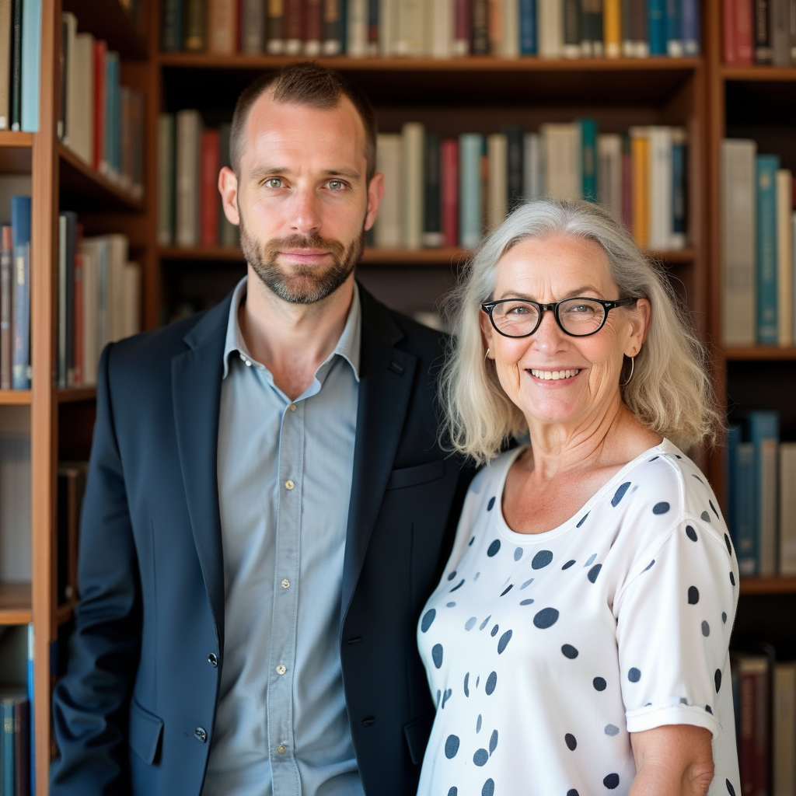

# Faces from 2 images plus select by attribute

You can drag and drop the main image, use the workflows for the others

prompt:

```
A man and a short-haired woman with a wrinkled face are standing in front of a bookshelf in a library.
The man is the man in the middle of image_1, and the woman is oldest woman in image_2
```

image_1:


image_2:


- Steps: 25
- Resolution: 1024x1024
- Guidance: 2.5/1.6
- Seed: 65
- Workflow: [OmniGen_00054__workflow.json](OmniGen_00054__workflow.json)



I swear it isn't cherry-picked

