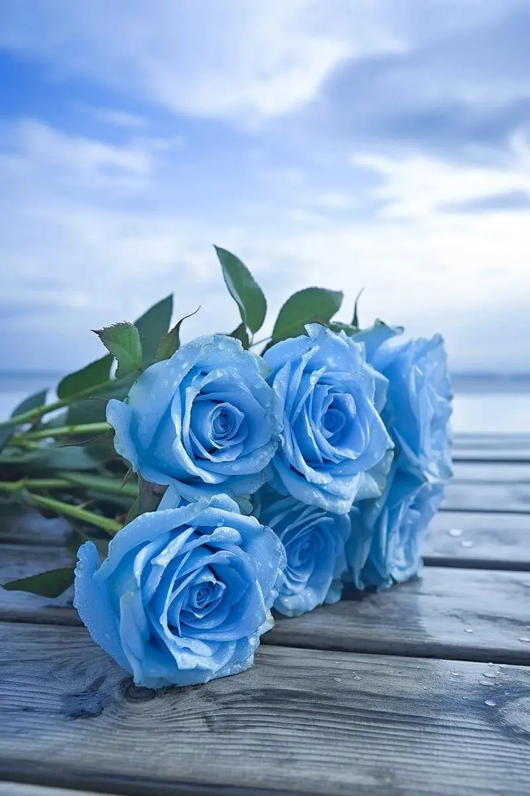
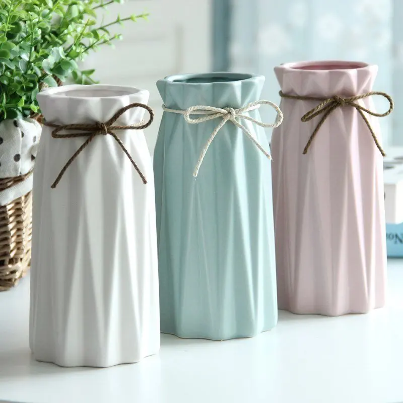
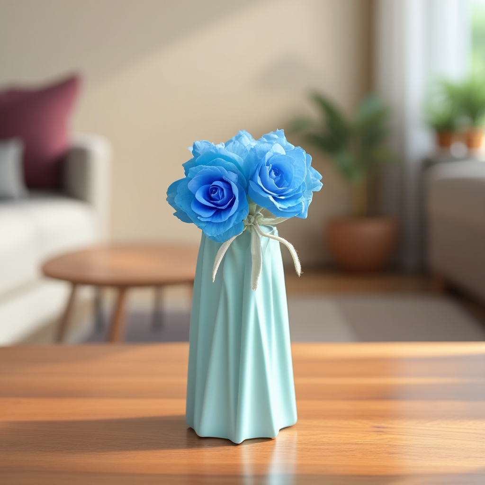

# Image composition

You can drag and drop the main image, use the workflows for the others

prompt:

```
The flower image_1 is placed in the vase which is in the middle of image_2 on a wooden table of a living room
```

image_1:



image_2:



- Steps: 25
- Resolution: 1024x1024
- Guidance: 2.5/1.6
- Seed: 66
- Workflow: [OmniGen_00056__workflow.json](OmniGen_00056__workflow.json)




