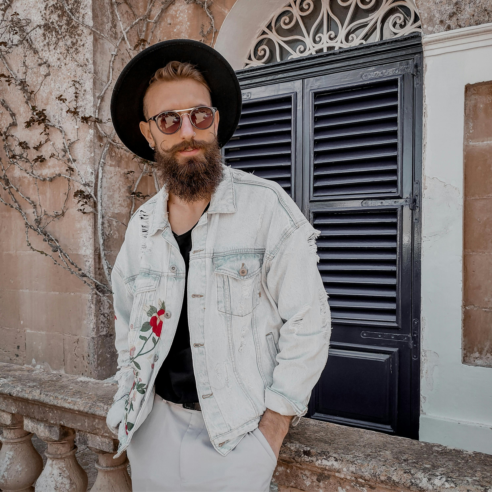
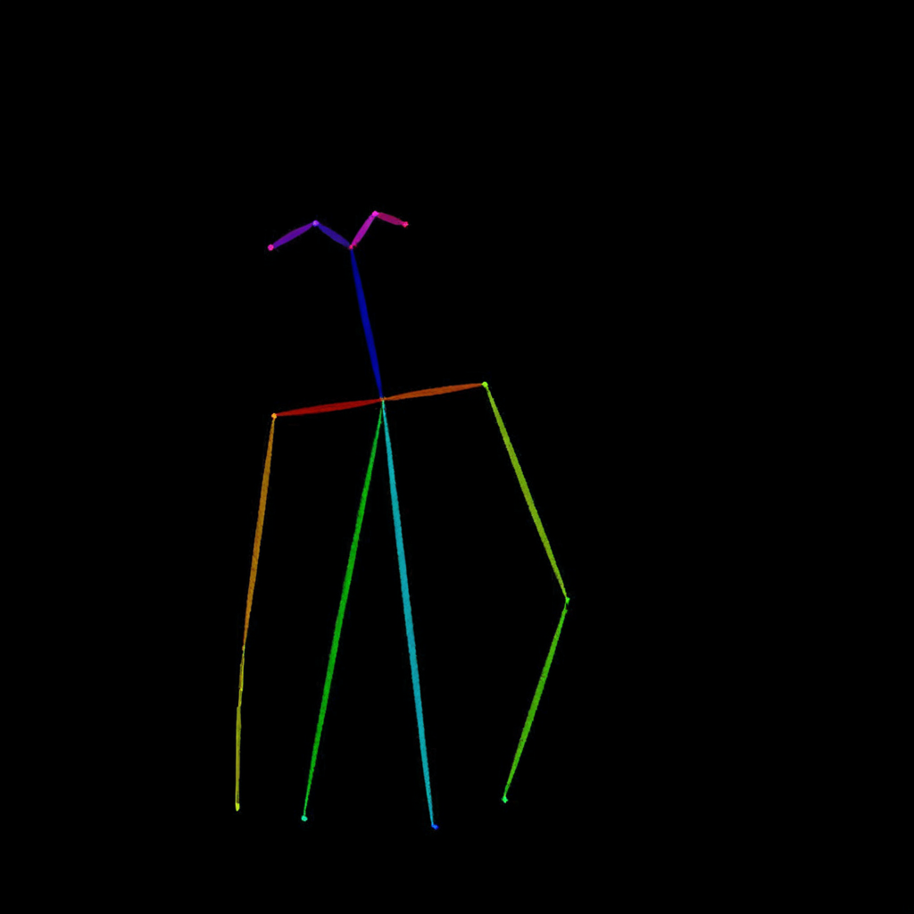
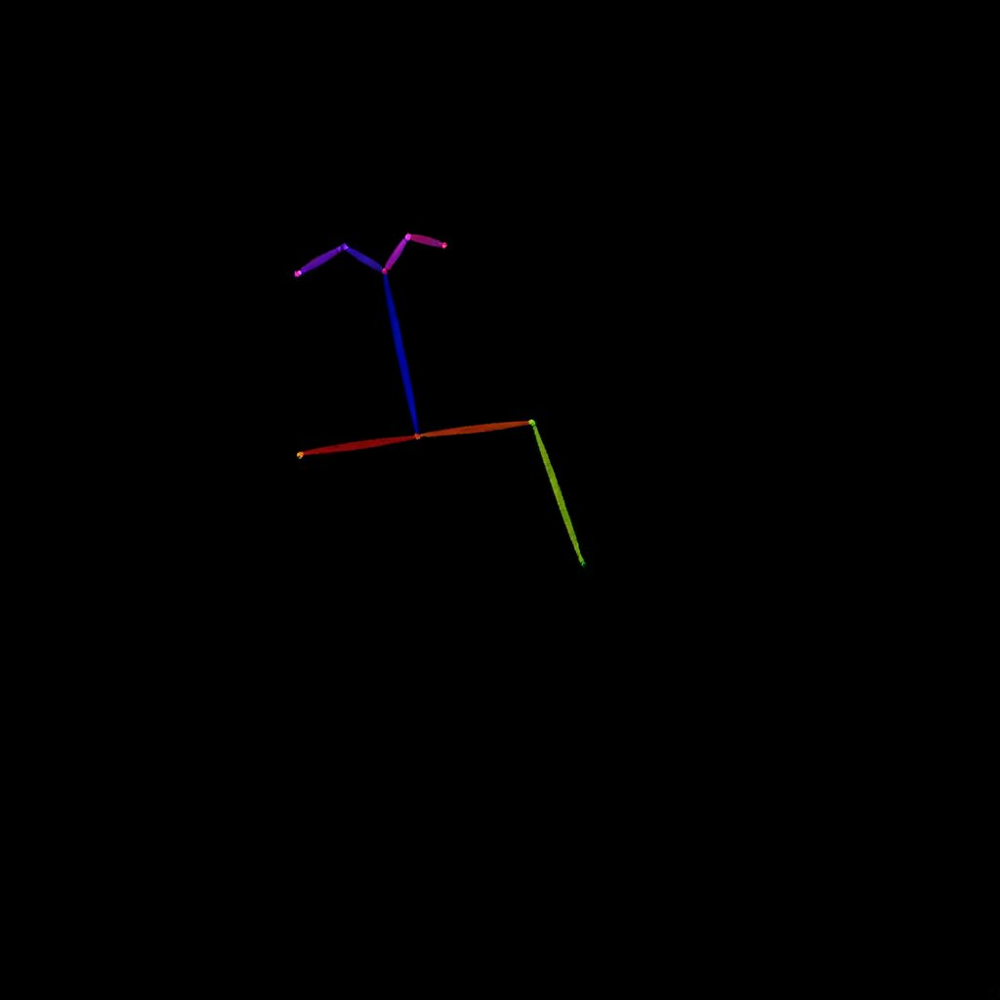
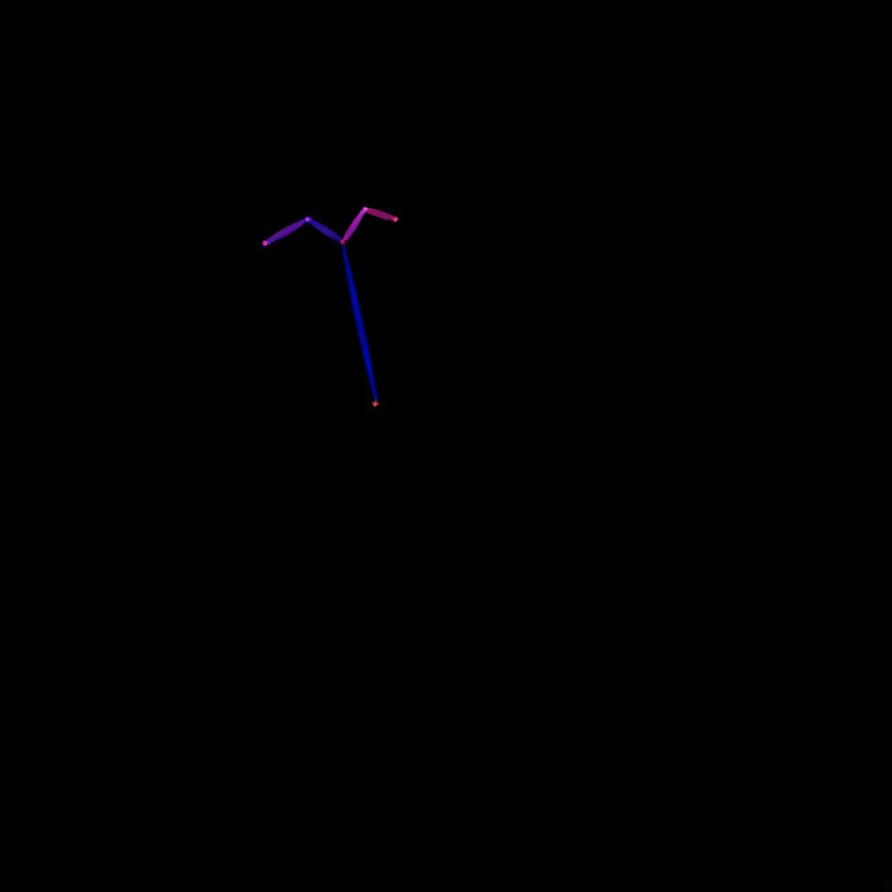
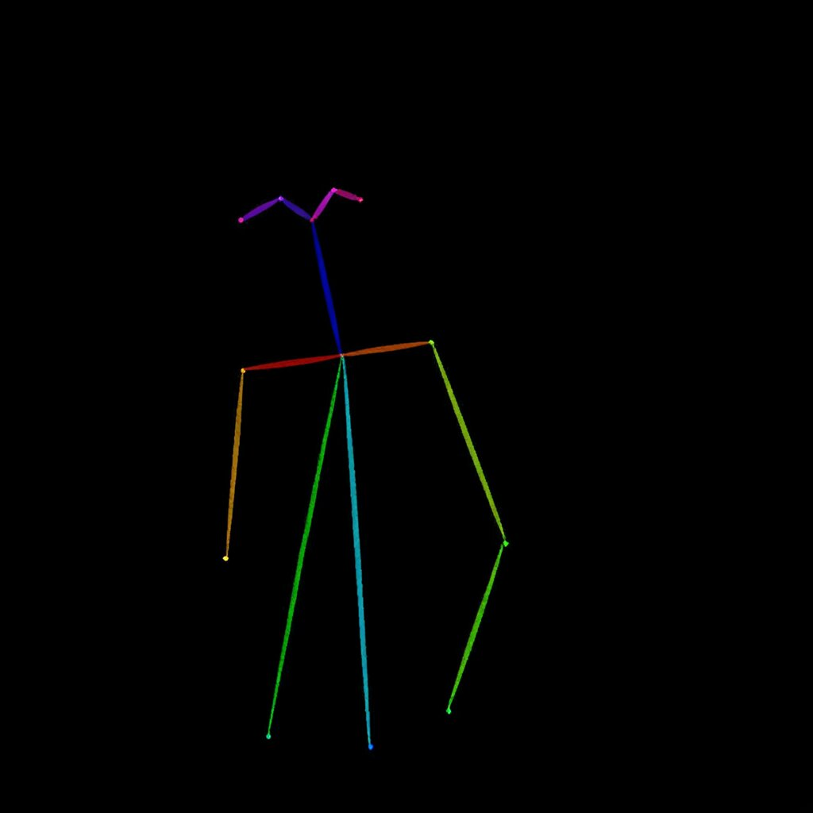

# Pose extractor

You can drag and drop the main image, use the workflows for the others

prompt:

```
Detect the skeleton of human in this image: image_1.
```

image_1:




- Steps: 25
- Resolution: 1024x1024
- Guidance: 2/1.6
- Seed: 66
- Workflow: [OmniGen_00057__workflow.json](OmniGen_00057__workflow.json)



I tried with 5, 10 and 20 steps. None achieved the nice result of 25 steps

# 5



# 10



# 20




