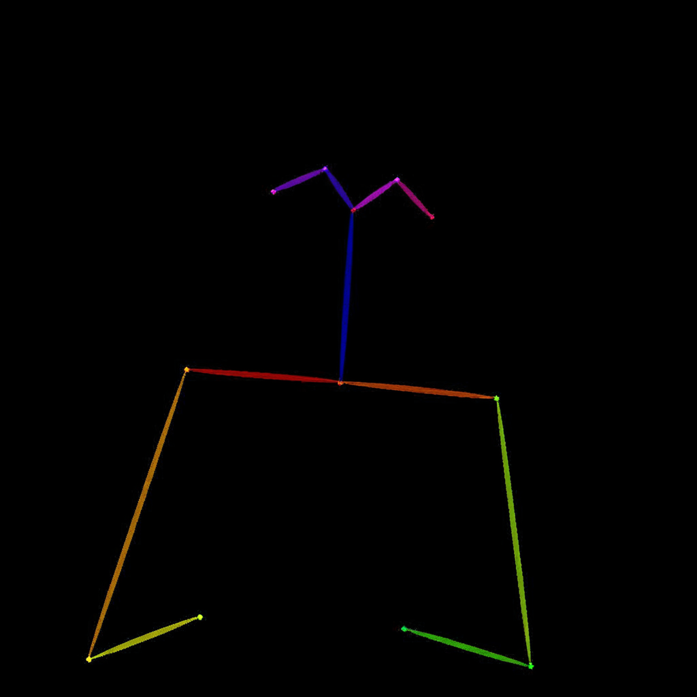
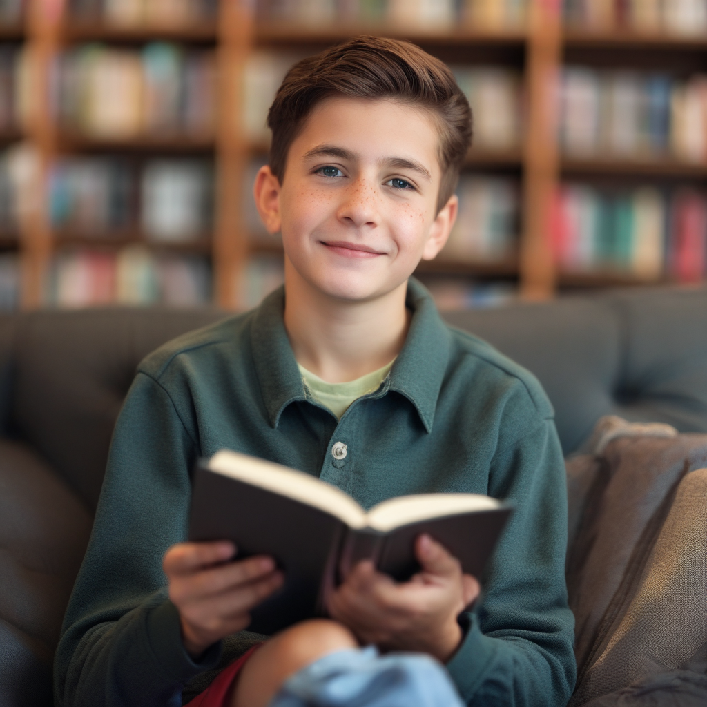

# Image impose pose

You can drag and drop the main image, use the workflows for the others

prompt:

```
Generate a new photo using the following picture and text as conditions: image_1
A young boy is sitting on a sofa in the library, holding a book.
His hair is neatly combed, and a faint smile plays on his lips, with a few freckles scattered across his cheeks.
The library is quiet, with rows of shelves filled with books stretching out behind him.
```

image_1:



- Steps: 20
- Resolution: 1024x1024
- Guidance: 2/1.6
- Seed: 999
- Workflow: [OmniGen_00061__workflow.json](OmniGen_00061__workflow.json)




