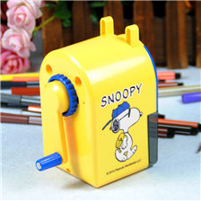
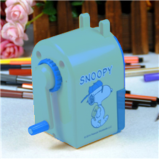
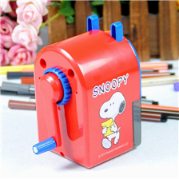
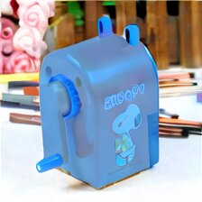
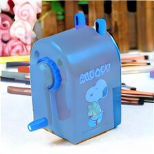

# Objective transference

You can drag and drop the main image, use the workflows for the others

prompt:

```
According to the following examples, generate an output for the input.
Input: image_1
Output: image_2

Input: image_3
Output:
```

image_1:



image_2:



image_3:



- Steps: 5
- Resolution: 224x224 (input @768)
- Guidance: 2.5/1.6
- Seed: 1
- Workflow: [OmniGen_00066__workflow.json](OmniGen_00066__workflow.json)


With more steps the details are better

# 10



# 15




